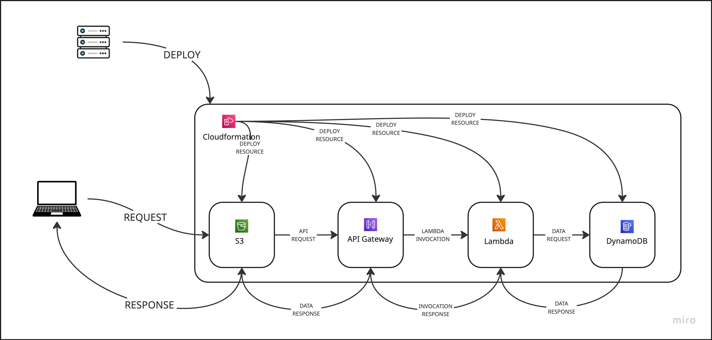

# ICP-UPV - 'Todo List´ - Trabajo 9 Despliegue de una API REST. 

Aplicación de tareas (todo) con frontend en React (Vite) y backend serverless (API Gateway + Lambda + DynamoDB). El entorno local se levanta con **Docker** usando **LocalStack** y servicios auxiliares. Para el despliegue en producción se utiliza **CloudFormation** y **AWS**.



## Requisitos

### Entorno local
- docker >= 28.0.0
- docker compose >= v2.39.2-desktop.1

### Entorno productivo
- aws cli >= 2.32.10 
- docker >= 28.0.0
- docker compose >= v2.39.2-desktop.1

## Estructura del repositorio

````
icp-upv
├── app
│   ├── backend
│   └── frontend
├── docker-compose.yml
├── docs
├── infrastructure
└── localstack
````
- **`app/backend`**: Lambda en Python que implementa CRUD sobre DynamoDB.
- **`app/frontend`**: Frontend React (Vite) que consume `/todos`.
- **`localstack`**: scripts y artefactos para inicializar LocalStack (API Gateway, Lambda, DynamoDB, swagger).
- **`infrastructure`**: plantillas CloudFormation para desplegar en AWS real.
- **`docs`**: documentación y recursos adicionales relacionados.

## Entorno local con LocalStack

Para arrancar el entorno de desarrollo se ha de ejecutar el comando `docker compose up` en el directorio raíz. Pasados unos segundos se habrán desplegado los siguientes recursos:
- **Frontend**: Servidor de desarrollo Vite en `http:localhost:5173`
- **Swagger**: Documentación de la API Gateway en `http://localhost:8001`.
- **API Gateway**: Disponible en la url dinámicamente creada en localstack.
- **DynamoDB-admin**: UI para consultar información de DynamoDB tables desplegadas en localstack.
- **MinIO**: Para subir el build de Vite, previo al pase a producción en `http://localhost:9000`.

Para más información consulte [LocalStack docs](./docs/LOCALSTACK.md)

## Despliegue en AWS
Las plantillas CloudFormation están en `infrastructure/`. Ver `infrastructure/README.md` para detalles de despliegue y parámetros.
